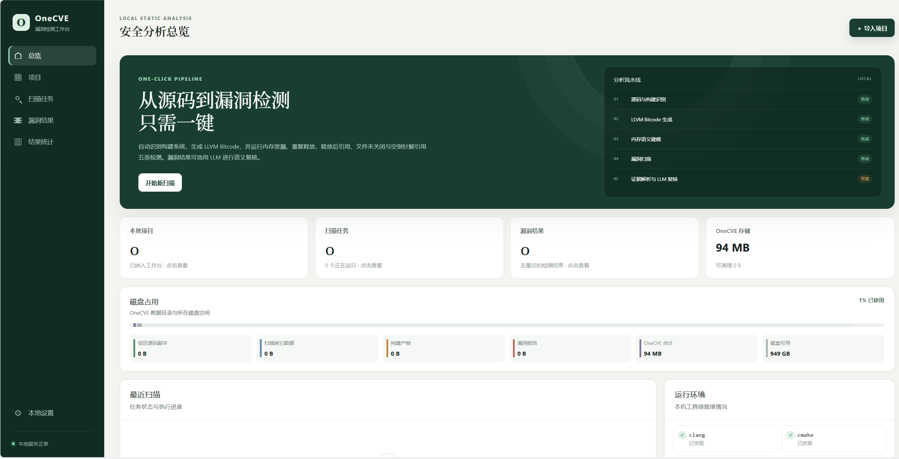

# OneCVE

OneCVE 是面向 C/C++ 项目的本地 Web 漏洞检测工具。它自动识别项目构建系统、生成 LLVM Bitcode，并基于定制的 SVF/Saber 完成漏洞扫描、证据解析、源码定位和可选的 LLM 复核。



## 功能

- 支持上传源码包或导入公开 Git 仓库。
- 自动适配 CMake、Meson、Autotools、Make 和 `compile_commands.json`。
- 检测内存泄漏、重复释放、释放后引用、文件未关闭和空指针解引用。
- 在线查看源码，标注访问、释放位置及调用路径。
- 支持 LLM 复核、人工验证、状态筛选和结果统计。
- 支持自定义内存分配/释放函数，以及 JSON、CSV 报告导出。
- 支持项目、扫描任务、构建产物和漏洞结果管理，并展示磁盘占用。

## 运行平台

OneCVE 以 `linux/amd64` Docker 容器交付：

- Windows 10/11 x64：使用 Docker Desktop，并启用 Linux Containers/WSL2。
- Linux x86_64：使用 Docker Engine 和 Docker Compose v2。

当前版本不是 Windows 原生程序；Windows 与 Linux 使用同一容器镜像。首次构建需要下载依赖并编译 SVF，建议至少准备 8 GB 内存和 20 GB 可用磁盘空间，并确保本机端口 `3000`、`8000` 未被占用。

## Docker 部署

推荐使用 [GitHub Releases](https://github.com/DataAvailable/OneCVE/releases) 提供的离线 Docker 包；也可以从源码构建镜像。

### 方式一：Release 离线包（推荐）

`v1.0.0` 提供的 `OneCVE-v1.0.0-docker-amd64.zip` 可同时用于 Windows x64 和 Linux x86_64。压缩包内包含：

```text
.env.example
compose.yaml
OneCVE-1.0-linux-amd64.tar
```

其中 tar 文件保存的是 `linux/amd64` 容器镜像；Windows 通过 Docker Desktop 的 Linux Containers/WSL2 运行同一镜像。

#### Windows PowerShell

1. 安装并启动 Docker Desktop，确认使用 Linux containers。
2. 下载 [`OneCVE-v1.0.0-docker-amd64.zip`](https://github.com/DataAvailable/OneCVE/releases/download/v1.0.0/OneCVE-v1.0.0-docker-amd64.zip)。
3. 在下载目录执行：

```powershell
Expand-Archive -LiteralPath .\OneCVE-v1.0.0-docker-amd64.zip -DestinationPath .\OneCVE-v1.0.0
Set-Location .\OneCVE-v1.0.0
docker load -i .\OneCVE-1.0-linux-amd64.tar
Copy-Item .env.example .env
docker compose up -d --no-build
```

`docker load` 应输出：

```text
Loaded image: onecve:local
```

#### Linux

1. 安装并启动 Docker Engine、Docker Compose v2 和 `unzip`。
2. 下载 Release 离线包后执行：

```bash
unzip OneCVE-v1.0.0-docker-amd64.zip -d OneCVE-v1.0.0
cd OneCVE-v1.0.0
docker load -i OneCVE-1.0-linux-amd64.tar
cp .env.example .env
docker compose up -d --no-build
```

> 必须在包含 `compose.yaml` 的解压目录中执行 Compose 命令。离线包不包含源码和 Dockerfile，因此请保留 `--no-build`；否则 Compose 会尝试从源码重新构建并失败。

### 方式二：从源码构建

适用于需要修改源码或自行构建镜像的场景。首次构建会下载系统依赖并编译 SVF，耗时和磁盘占用明显高于离线部署。

```bash
git clone https://github.com/DataAvailable/OneCVE.git
cd OneCVE
docker compose up -d --build
```

### LLM 配置（可选）

离线部署命令会将 `.env.example` 复制为 `.env`；不使用 LLM 复核时保持默认空值即可，启动后也可以在“本地设置”页面配置模型服务。从源码构建时，如需预先配置，可在包含 `compose.yaml` 的目录中复制模板：

Windows PowerShell：

```powershell
Copy-Item .env.example .env
```

Linux：

```bash
cp .env.example .env
```

按需编辑 `.env`：

```dotenv
OPENAI_API_KEY=your-api-key
NSPA_LLM_MODEL=gpt-4o-mini
NSPA_LLM_BASE_URL=https://api.openai.com/v1
NSPA_LLM_CHAT_PATH=/chat/completions
```

`NSPA_LLM_BASE_URL` 支持 OpenAI 兼容的云端或本地模型服务。本地模型部署在 Windows 宿主机时，容器内通常应通过 `host.docker.internal` 访问，而不是使用 `127.0.0.1`。

修改 `.env` 后执行以下命令重建容器，使配置生效；离线部署请保留 `--no-build`：

```bash
docker compose up -d --no-build
```

### 验证启动

检查容器状态和日志：

```bash
docker compose ps
docker compose logs --tail 100 onecve
```

当容器状态为 `healthy` 后访问：

- Web 工作台：<http://127.0.0.1:3000>
- API 健康检查：<http://127.0.0.1:8000/api/health>
- API 文档：<http://127.0.0.1:8000/docs>

Windows PowerShell 也可以执行以下命令验证 API：

```powershell
Invoke-RestMethod http://127.0.0.1:8000/api/health
```

默认端口仅绑定到 `127.0.0.1`，不会暴露到局域网。

## 日常管理

查看实时日志：

```bash
docker compose logs -f onecve
```

停止和重新启动：

```bash
docker compose stop
docker compose start
```

从源码部署时，更新源码并重新构建：

```bash
git pull
docker compose up -d --build
```

删除容器但保留项目和扫描数据：

```bash
docker compose down
```

数据保存在 Docker 卷 `onecve-data` 中。以下命令会同时永久删除该卷及全部 OneCVE 数据，请谨慎执行：

```bash
docker compose down -v
```

## 使用说明与安全提示

项目导入、扫描配置、漏洞复核、结果导出和故障排查参见 [OneCVE 使用手册](docs/USER_GUIDE.md)。

OneCVE 默认在本机运行，容器以非 root 用户执行，并删除 Linux capabilities、启用 `no-new-privileges`。启用远程 LLM 复核后，漏洞证据、调用路径和相关源码片段会发送至所配置的模型服务；分析敏感项目时，建议关闭 LLM 复核或使用可信的本地模型。

## License

项目许可证见 [LICENSE](LICENSE)。SVF 及镜像内其他第三方组件分别遵循其自身许可证。
